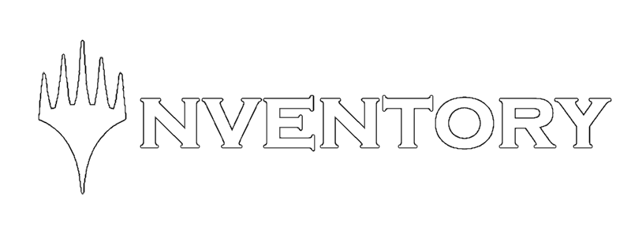
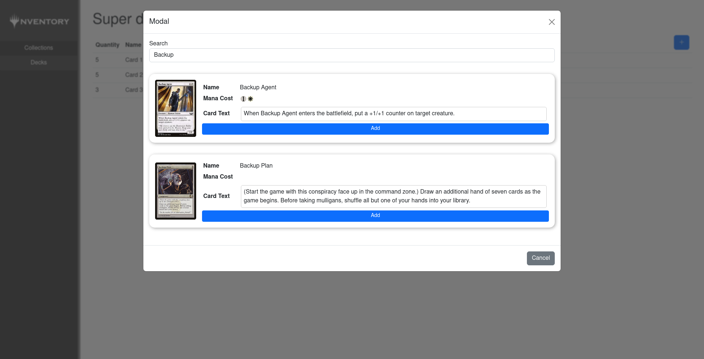

Lorem ipsum dolor sit amet, consetetur sadipscing elitr, sed diam nonumy eirmod tempor invidunt ut labore et dolore magna aliquyam erat, sed diam voluptua. At vero eos et accusam et justo duo dolores et ea rebum. Stet clita kasd gubergren, no sea takimata sanctus est Lorem ipsum dolor sit amet.

# Deplyoment

## Kubernetes 

Use the files inside `kubernetes_deployment/` to deploy on Kubernetes

## Docker

TBD

## Cloud Provider

TBD

# Roadmap

These are the planed versions to be released.

## Version 1.0.0

- [ ] Creating Collections, Folders, Cards, Decks
- [ ] Import Delver Files (CSV, .delver, etc. **TBD**)
- [ ] Deplyoment with Kubernetes

## Version 1.1.0

- [ ] Mobile Friendly UI
- [ ] Deployment with Docker Compose
- [ ] Example Deployments on Hostsers (Hetzner, AWS, etc. **TBD**)

# Contributers

    
    

# Contribute

Yes please :)

Just send us a PR.