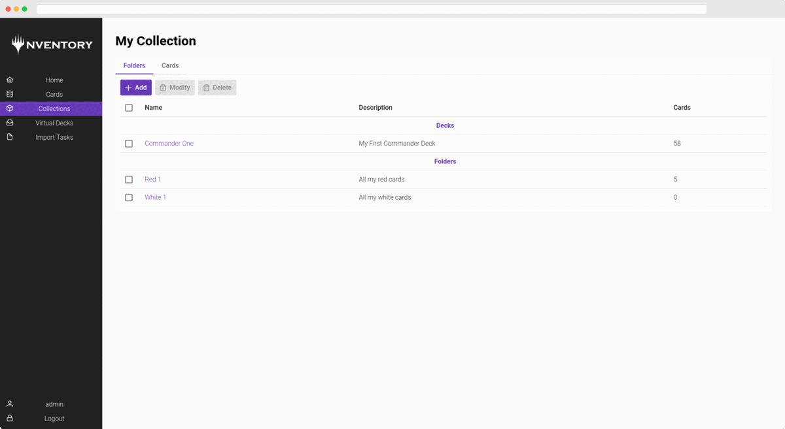

Self hosted, modern, web based Magic the Gathering inventory & deck building system.
You can import CSVs from known apps like Delver.



Demo: [https://ynventory.mtg-ynventory.com](https://ynventory.mtg-ynventory.com)


# Roadmap

These are the planed versions to be released:

## Version 1.0.0

- [ ] User Login (Every User has his own collection) 
- [X] Creating Collections, Folders/Decks, Cards, Virtual Decks
- [X] Deplyoment with Kubernetes
- [X] Deployment with Docker Compose
- [ ] Import Delver Files (CSV)

## Version 1.1.0

- [ ] Mobile Friendlier UI
- [ ] Example Deployments on Hostsers (Hetzner, AWS, etc. **TBD**)
- [ ] More Import Options


# Deplyoment

## Kubernetes 

Use the files inside `deployments/kubernetes/` to deploy on Kubernetes

## Docker

Needed Packages:
- git
- docker
- docker-compose

Run this on your docker host, inside the folder you want to use to store data:

```bash
# Downlaod Docker Compose
git clone https://github.com/melvin-suter/Ynventory.git
mv Ynventory/deployments/docker/* ./
rm -rf Ynventory/

# Change DB Password (only run once)
sed -i "s;YNVENTORYPASSWORD;$(date | md5sum | awk '{print $1}');" docker-compose.yml

# Run Compose
docker-compose up -d
```

### Certificates

Use this: [https://github.com/acmesh-official/acme.sh](https://github.com/acmesh-official/acme.sh)

## Cloud Provider

TBD

# Contributers

<div>
    <a href="https://github.com/melvin-suter"></a>
    <a href="https://github.com/pluethi1"></a>
</div>

# Contribute

Yes please :)

Just send us a PR.